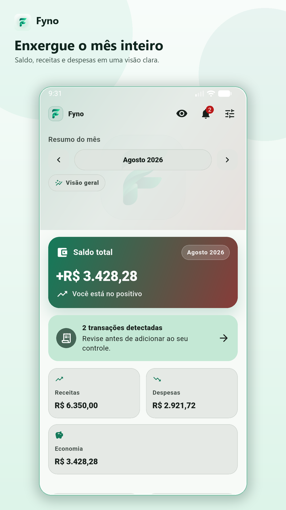
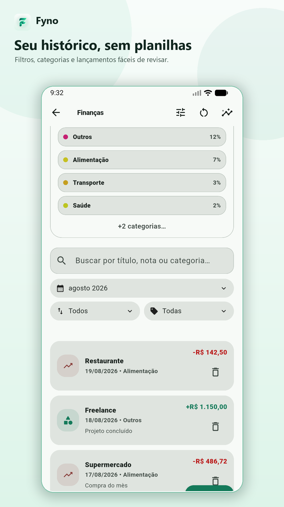
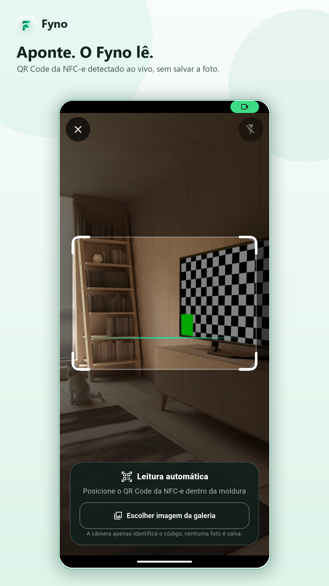

# Fyno

> Controle financeiro pessoal com clareza, contexto e privacidade.



O Fyno é um aplicativo Flutter para acompanhar receitas, despesas e decisões
financeiras do dia a dia em um só lugar. A experiência combina um dashboard
objetivo, extrato inteligente, metas, recorrências, cartões e recursos de
importação de compras — mantendo os dados sensíveis sob controle do usuário.

## O que o Fyno oferece

- Dashboard mensal com saldo, receitas, despesas e evolução visual.
- Lançamento e edição de transações por categoria, conta e cartão.
- Metas de economia, orçamentos e despesas recorrentes.
- Registro de veículos, abastecimentos e custo por quilômetro.
- Leitura de QR Code/NFC-e e confirmação dos itens antes de importar.
- Detecção opcional de notificações bancárias no Android, sempre com revisão.
- Backup e restauração, incluindo integração opcional com Google Drive.
- Tema claro/escuro e suporte a Android, iOS e Web.

## Produto em imagens

| Visão do mês | Extrato inteligente |
|---|---|
|  |  |

| Notificações seguras | QR Code ao vivo |
|---|---|
|  |  |

| Temas e backup |
|---|
|  |

## Plataformas

- **Android:** experiência completa, incluindo câmera, QR Code e detecção local de notificações bancárias.
- **Web:** banco SQLite persistido no navegador; recursos exclusivos do Android são sinalizados como indisponíveis.
- **iOS:** fluxo financeiro e QR Code; o sistema não oferece acesso geral às notificações de outros aplicativos.

## Stack

- Flutter + Dart 3.10+
- SQLite via `sqflite`
- Material 3, internacionalização e temas adaptativos
- ML Kit para reconhecimento de texto
- Scanner de QR Code e WebView para portais fiscais
- Google Drive opcional para backup

## Como executar

Requisitos: Flutter estável compatível com Dart 3.10 ou superior, Android SDK e JDK 17/21.

```bash
flutter pub get
flutter analyze
flutter test
flutter run
```

Para executar a versão Web, mantenha `web/sqlite3.wasm` e `web/sqflite_sw.js` disponíveis. Se necessário, regenere-os com:

```bash
dart run sqflite_common_ffi_web:setup --force
```

## Privacidade

As notificações selecionadas são filtradas e processadas localmente. Apenas os pacotes dos bancos escolhidos são observados; tokens, senhas, códigos de verificação, ofertas e alertas sem valor transacional são descartados. Toda sugestão exige revisão antes de virar uma transação.

Leia a [política de privacidade](docs/privacy-policy-pt-BR.md) para detalhes.

## Status

O projeto está em evolução ativa. Consulte o histórico de commits e abra uma issue para relatar problemas ou sugerir melhorias.

## Licença

Projeto privado. Consulte o autor antes de reutilizar código, marca ou assets.
